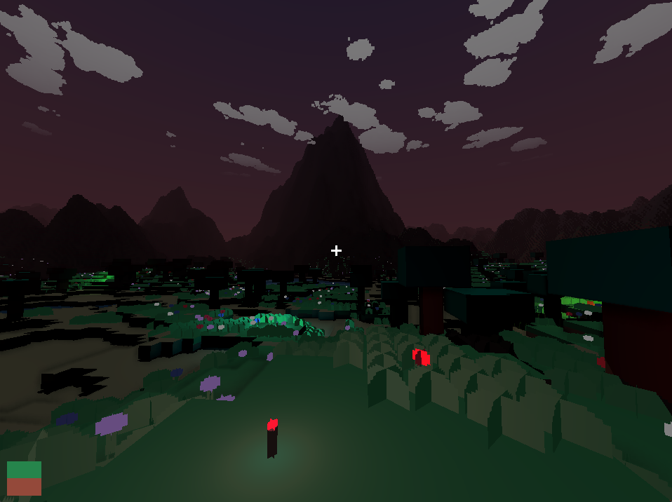
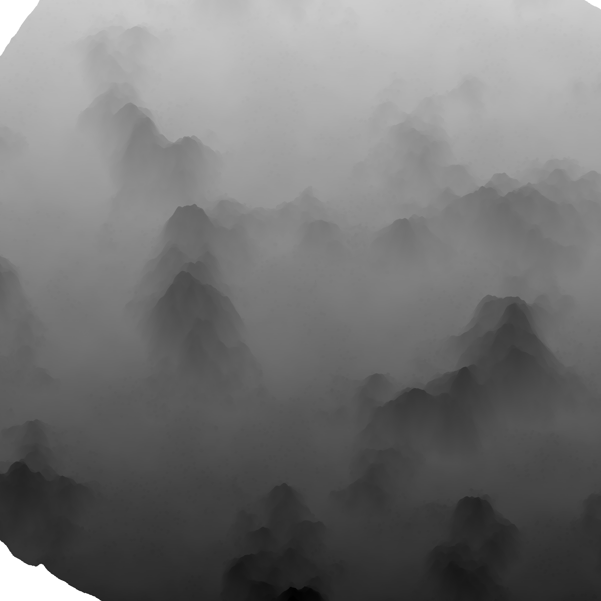
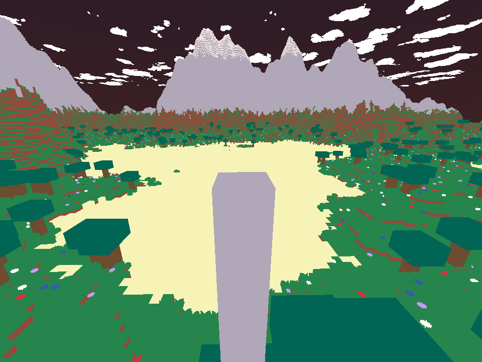
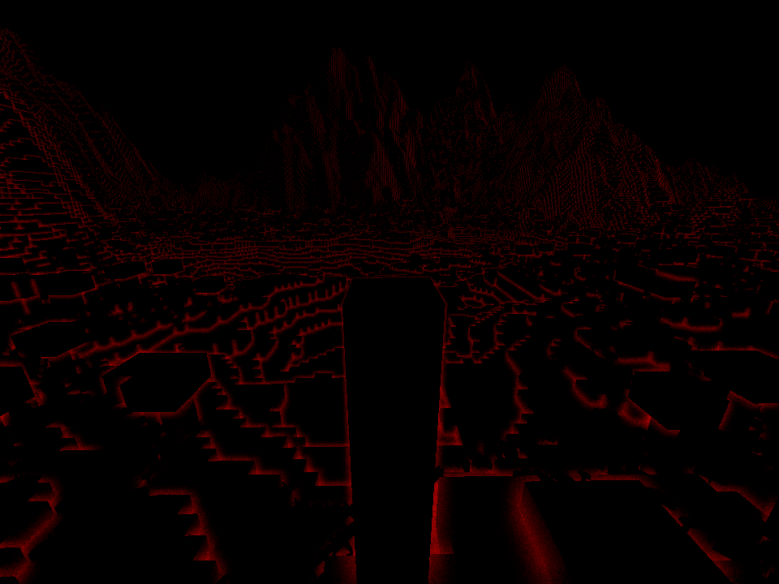
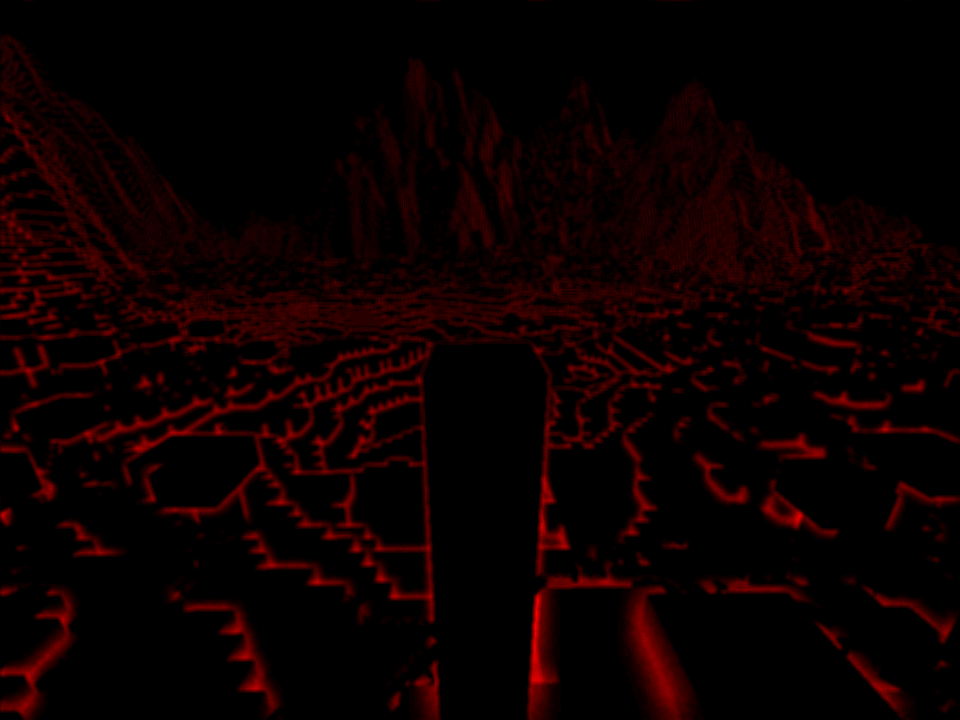
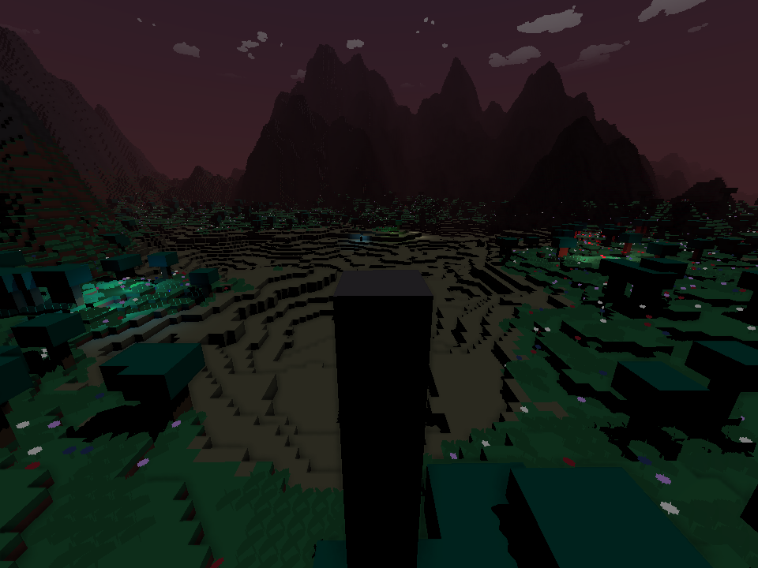
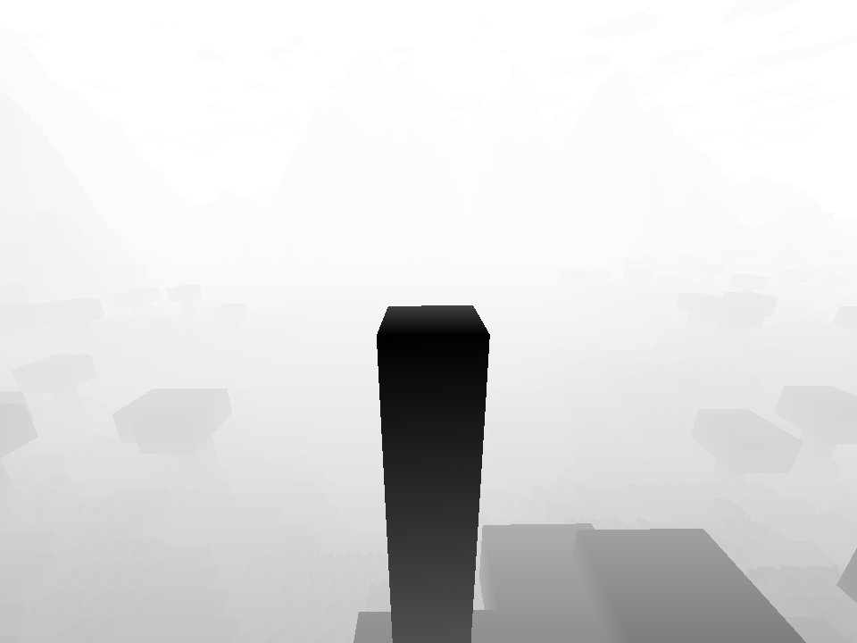
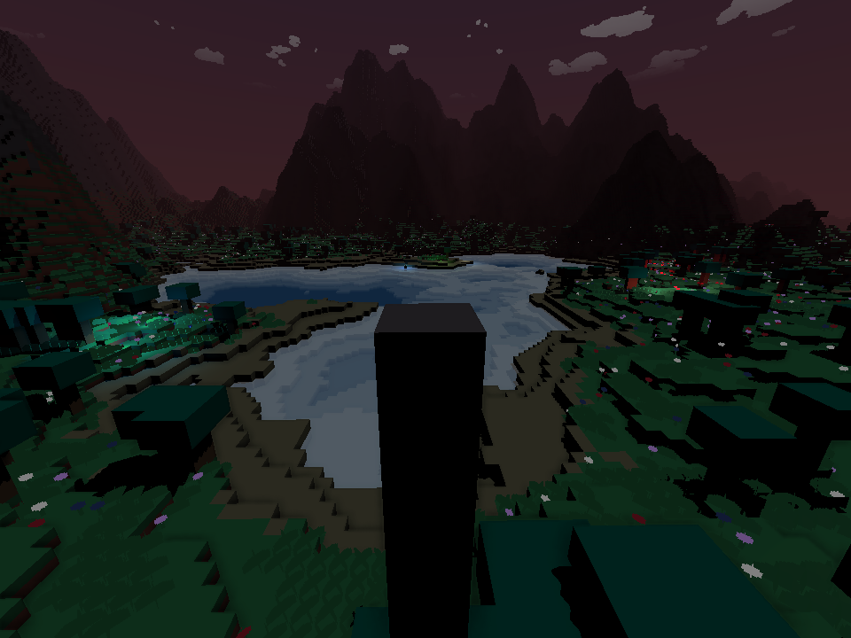
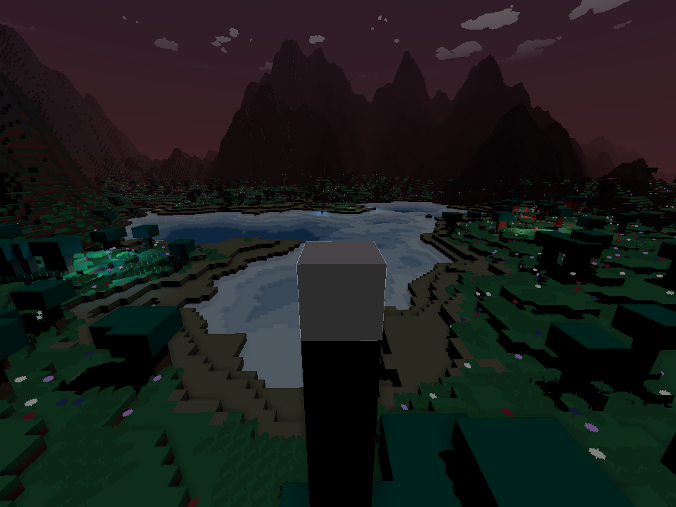
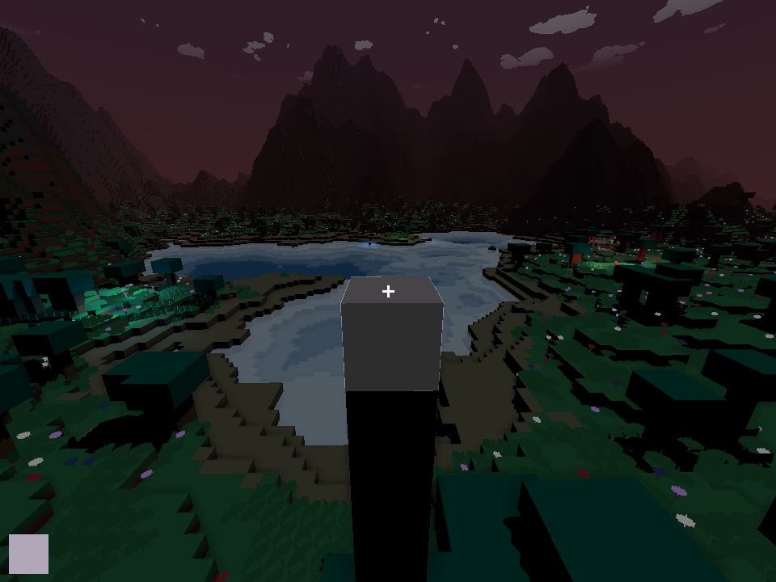

# Blocks



Tiny Minecraft clone in C and HLSL using the new SDL3 GPU API

### Features

- Procedural world generation
- Asynchronous chunk loading
- Blocks and sprites
- Persistent worlds
- Directional shadows
- Clustered dynamic lighting
- Basic transparency

### Building

#### Windows

```bash
git clone https://github.com/jsoulier/blocks --recurse-submodules
cd blocks
mkdir build
cd build
cmake ..
cmake --build . --parallel 8 --config Release
cd bin
./blocks.exe
```

#### Linux

```bash
git clone https://github.com/jsoulier/blocks --recurse-submodules
cd blocks
mkdir build
cd build
cmake .. -DCMAKE_BUILD_TYPE=Release
cmake --build . --parallel 8
cd bin
./blocks
```

#### Shaders

Shaders are prebuilt.
To build locally, install [glslc](https://github.com/google/shaderc) and [SDL_shadercross](https://github.com/libsdl-org/SDL_shadercross) to your path

### Controls

- `WASDEQ` to move
- `Escape` to unfocus
- `Left Click` to break a block
- `Middle Click` to select a block
- `Right Click` to place a block
- `Scroll` to change blocks
- `F11` to toggle fullscreen
- `LControl` to move quickly

### Passes

1. Render opaques to depth texture (for shadows)



2. Render sky to G-buffer


3. Render opaques to G-buffer



4. Calculate SSAO



5. Blur SSAO



6. Composite G-buffer



7. Render transparents to depth teture (for predepth)



8. Render transparents and composite



9. Render raycast



10. Render UI


