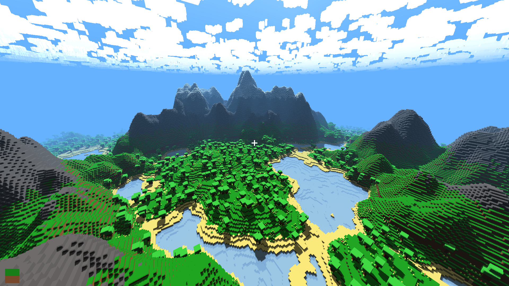

# Blocks



Tiny Minecraft clone in C and GLSL using the new SDL3 GPU API

### Features

- Procedural world generation
- Blocks and plants
- Basic shadow mapping
- Persistent worlds

### Download

You can find Windows downloads [here](https://github.com/jsoulier/blocks/releases)

### Building

The app _should_ build everywhere but I haven't tested

```bash
git clone https://github.com/jsoulier/blocks --recurse-submodules
cd blocks
mkdir build
cd build
cmake ..
cmake --build . --parallel 8 --config Release
./bin/blocks.exe
```

### Controls
- WASD to move
- EQ to move up and down
- Escape to unfocus
- Left Click to break a block
- Right Click to place a block
- B to toggle blocks
- F11 to toggle fullscreen
- Left Control to go super speed